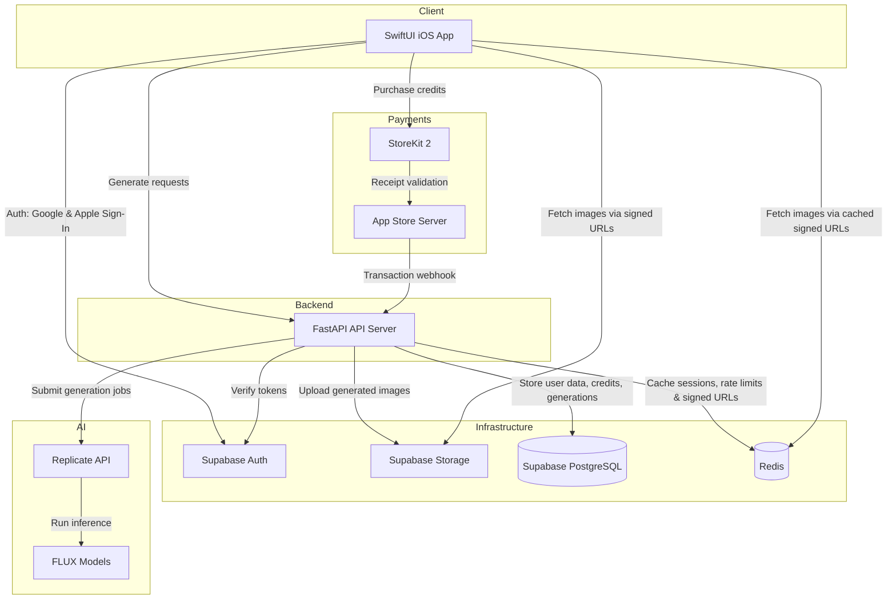

# Illumity - Architecture Overview

Illumity is an AI-powered image generation iOS app.
Users describe what they want, and the app generates images using
state-of-the-art diffusion models.
It runs on a credit-based system — users purchase credits via in-app
purchases and spend them to generate images.

## System Architecture

## Key Components

### iOS App
The app is built in Swift and SwiftUI following an MVVM pattern.

### Auth — Google and Apple Sign-In via Supabase Auth. 
Tokens are stored securely using a KeychainManager wrapper around
the iOS Keychain.
Image Generation — users enter a prompt, select model options, and submit.
Credits & Purchases — StoreKit 2 handles in-app purchases natively.
Credit balances are managed server-side to prevent tampering.
Account Management — account deletion is gated behind Face ID
via LocalAuthentication, with full Apple ID token revocation
using ASAuthorizationAppleIDProvider.

### Backend
A Python FastAPI server deployed on Railway.
Responsibilities

Authenticate and authorize requests via Supabase Auth token verification.
Manage user credit balances — deduct on generation, add on confirmed purchase.
Proxy generation requests to Replicate's API, running FLUX models
from Black Forest Labs.
Upload completed images to Supabase Storage and return signed URLs to the client.
Cache active sessions and enforce rate limits via Redis.

### Data Layer

PostgreSQL (hosted by Supabase) — users, credit transactions, generation history.
Redis — session caching, rate limiting, signed URL caching
(TTL of one week to avoid regenerating URLs on every gallery view),
and pipeline batching for bulk reads.
Supabase Storage (AWS S3 based) — generated images stored with signed URLs
for secure, time-limited access.