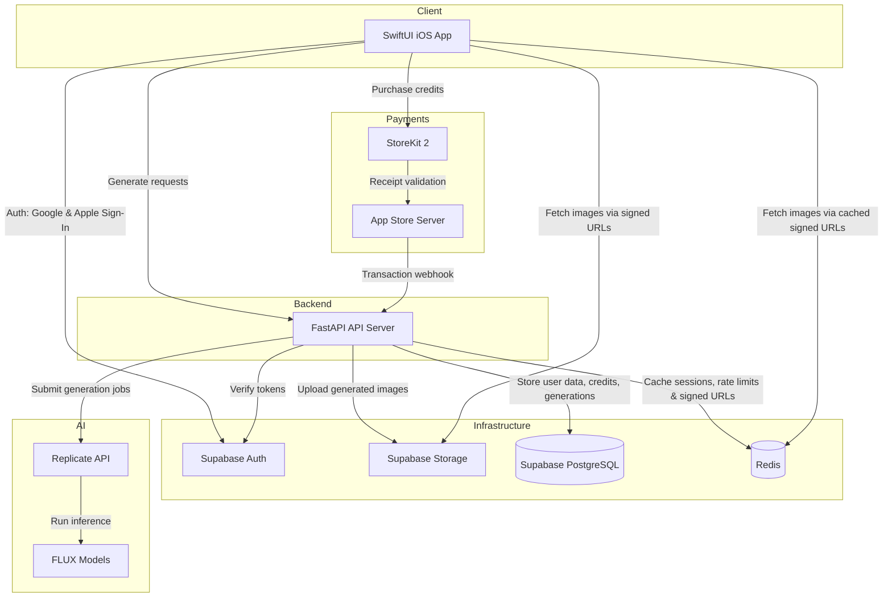

```mermaid
graph TB
    subgraph Client
        App[SwiftUI iOS App]
    end

    subgraph Backend
        API[FastAPI API Server]
    end

    subgraph Infrastructure
        SB_Auth[Supabase Auth]
        SB_Storage[Supabase Storage]
        SB_DB[(Supabase PostgreSQL)]
        Redis[(Redis)]
    end

    subgraph AI
        Replicate[Replicate API]
        FLUX[FLUX Models]
    end

    subgraph Payments
        StoreKit[StoreKit 2]
        AppStore[App Store Server]
    end

    App -->|Auth: Google & Apple Sign-In| SB_Auth
    App -->|Generate requests| API
    App -->|Purchase credits| StoreKit
    StoreKit -->|Receipt validation| AppStore
    AppStore -->|Transaction webhook| API

    API -->|Verify tokens| SB_Auth
    API -->|Store user data, credits, generations| SB_DB
    API -->|Cache sessions, rate limits & signed URLs| Redis
    API -->|Upload generated images| SB_Storage
    API -->|Submit generation jobs| Replicate
    Replicate -->|Run inference| FLUX

    App -->|Fetch images via signed URLs| SB_Storage
    App -->|Fetch images via cached signed URLs| Redis
```