# Still200 - Architecture Overview

Still200 is an uptime monitoring platform for indie developers.
It watches your APIs around the clock, alerts you when things go down,
and provides AI-powered root cause analysis to help you fix issues faster.

## Design Philosophy

No frameworks, no message brokers, no magic.
Still200 is built on async Python workers coordinated through
Redis primitives — sorted sets, lists, and Pub/Sub.
Every component is simple enough to reason about, debug,
and replace independently.

```mermaid
graph TB
    subgraph Services
        API[API Service]
        Scheduler[Scheduler Service]
        Checker[Checker Service]
        Notifier[Notifier Service]
    end

    subgraph Infrastructure
        Redis[(Redis)]
        SB_DB[(Supabase PostgreSQL)]
        SB_Auth[Supabase Auth]
    end

    subgraph External
        Targets[Monitored APIs]
        Notify_Channels[Email / Webhook / Slack]
        AI[Claude AI - Haiku & Sonnet]
    end

    API -->|Read/write monitors, incidents| SB_DB
    API -->|Verify tokens| SB_Auth
    API -->|Subscribe to events| Redis

    Scheduler -->|Read schedule from sorted set| Redis
    Scheduler -->|Enqueue due checks| Redis

    Checker -->|Dequeue check jobs via BRPOP| Redis
    Checker -->|Execute health checks| Targets
    Checker -->|Write check results & RCA| SB_DB
    Checker -->|Publish state changes| Redis
    Checker -->|Enqueue notifications via LPUSH| Redis
    Checker -->|Trigger AI analysis on state transitions| AI

    Notifier -->|Dequeue alerts via BRPOP| Redis
    Notifier -->|Deliver alerts| Notify_Channels
    Notifier -->|Store alert history| SB_DB

    API -.->|SSE fan-out via Pub/Sub| Redis
```

## Services
### API Service
The entry point for users. Handles CRUD for monitors,
retrieves incident history, and streams real-time updates to the
dashboard via Server-Sent Events (SSE).
SSE fan-out is powered by Redis Pub/Sub — the API subscribes to
relevant channels and streams events to connected clients
using FastAPI's StreamingResponse.

### Scheduler Service

Maintains the check schedule using a Redis sorted set,
where each member is a monitor ID and the score is its next check timestamp.
The scheduler runs a loop, pulling due monitors with ZRANGEBYSCORE,
enqueuing them as check jobs, and updating their next run time.

### Checker Service

The workhorse. Listens for check jobs via BRPOP on a Redis list,
executes HTTP health checks against monitored endpoints, and records results.
On state transitions (up → down or down → up), it triggers AI-powered
root cause analysis using Claude (Haiku for fast triage,
Sonnet for deeper analysis), stores the RCA alongside the incident in
Supabase, publishes events to Redis Pub/Sub,
and enqueues notification jobs via LPUSH.

### Notifier Service

Consumes notification jobs from a Redis list via BRPOP and
delivers alerts through configured channels.
We'll have APNs to start with but later email, webhook, Slack.
The Notifier reads the AI-generated RCA from Supabase and includes
it in the alert. Its sole responsibility is delivery — no analysis,
no state management.

### Service Communication

All inter-service communication flows through Redis.
There is no direct service-to-service communication.
